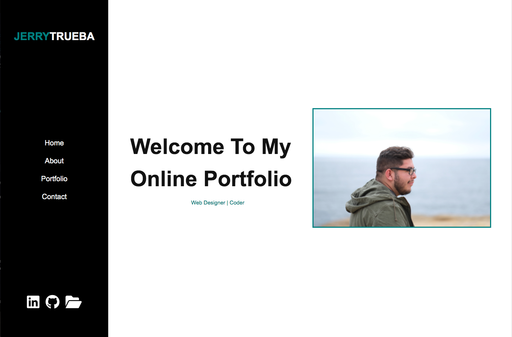
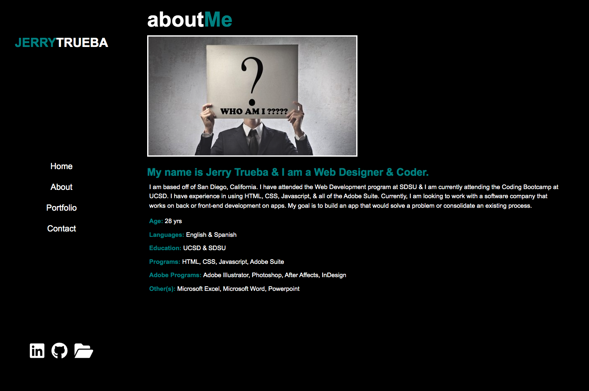
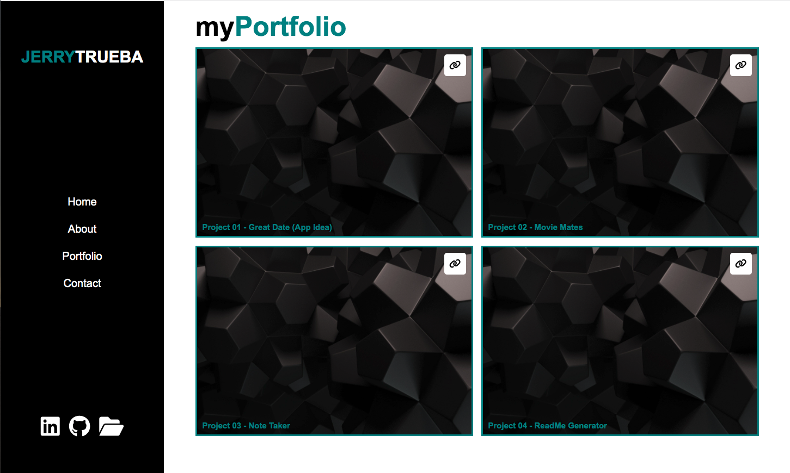
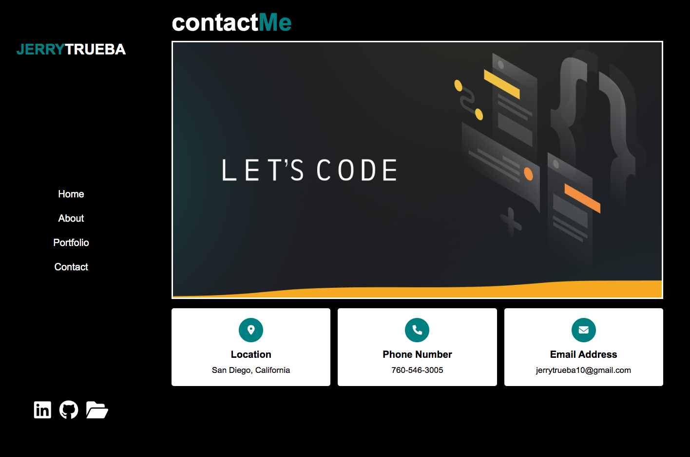
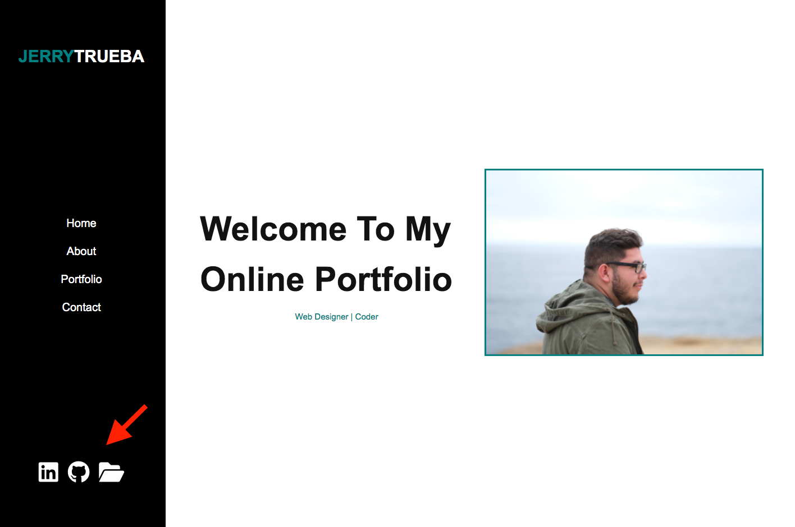

# Online Portfolio

**To see my Online Portfolio:**

https://jerrytrueba.github.io/online-portfolio/

**Github Repositories:**

https://github.com/jerrytrueba/online-portfolio

**Online Portfolio Information**

In this online portfolio you will be able to see and review some of the work that has been completed throughout my time in the Coding Bootcamp.
You will be able to see my first group project (Great Date - App Idea) and other homework assignments. This portfolio also includes links to my Github repositories and LinkedIn account.

**Example of Online Portfolio**

When you first visit my online portfolio, you will be greeted by a message (Welcome To My Online Portfolio) and picture of myself.

If you were to click on 'About' on the left hand side, it will then scroll down to a small bio about myself. This includes a small paragraph on who I am, where I currently live, and what I am looking into getting career wise. It will also showcase some of my professional skills and education.

Next, by clicking on 'Portfolio', it will scroll down to small snipet of some of the projects and homework assignments I have worked on. If you were to click on the small gray box on the ride hand corner of the bigger box, it will redirect you to that project/homework assignment in Github.

Finally, by clicking on 'Contact', it will scroll down to the end of my online portfolio and how you are able to get in contact with me.

**Additional Features**

On the left hand side of the online portfolio, you will see 3 small icons at the bottom. The first one icon, starting from left to right, will redirect you to my LinkedIn account. The middle icon, will redirect you to my Github profile. The last icon, will redirect you to my most current resume.

**Programs Used**
1. HMTL
2. CSS

**Websites Used**

https://fontawesome.com/
